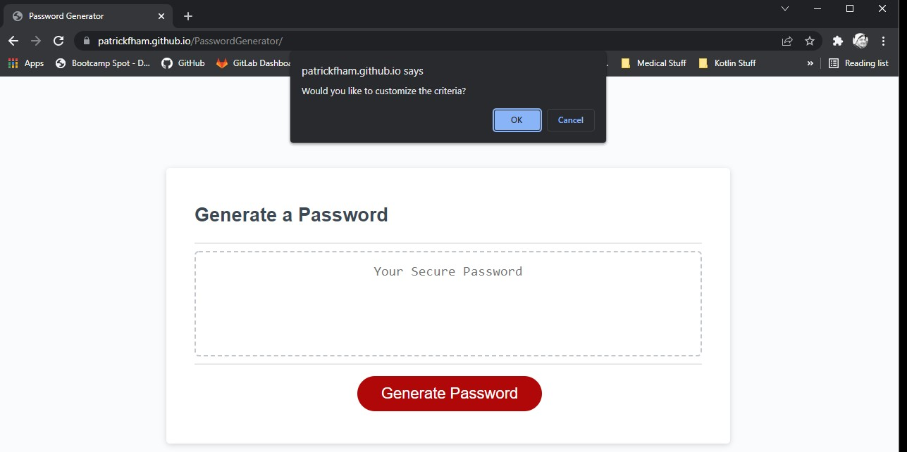
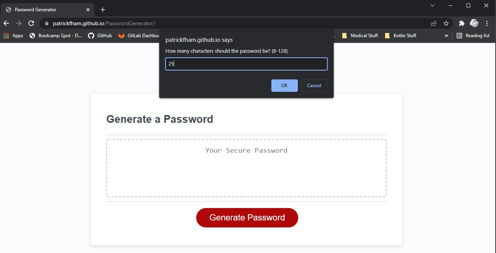
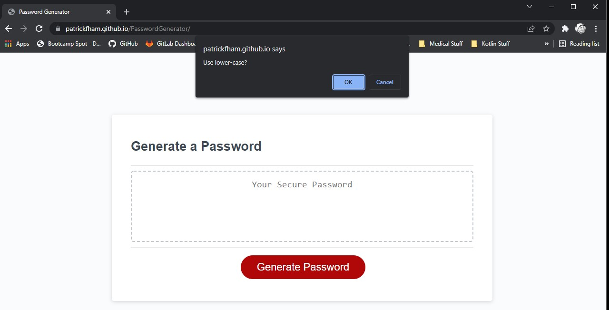
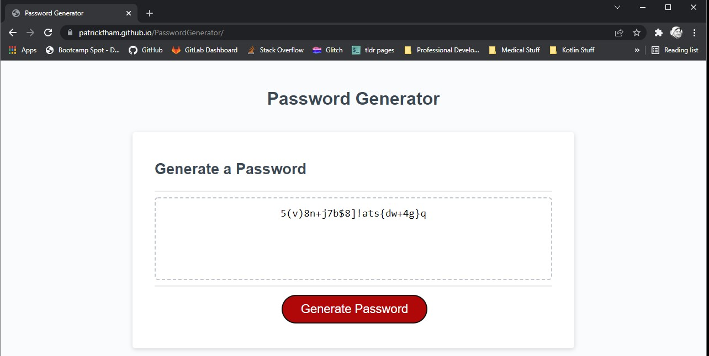

# Password Generator
Link to the Password Generator - https://patrickfham.github.io/PasswordGenerator/

## How it Works
- The user will be prompted whether or not they want to customize the properties of the password.  If not, a generic one is given.
- If customized, the next few prompts will ask for the number of characters, and if they want to use lowercase, uppercase, numbers, and symbols.
- The generated password is displayed.

## Technologies Used
- HTML/CSS
- JavaScript

## Video Demo
https://watch.screencastify.com/v/V9swwrYvE6oEYUKAYInR

## Screenshots

