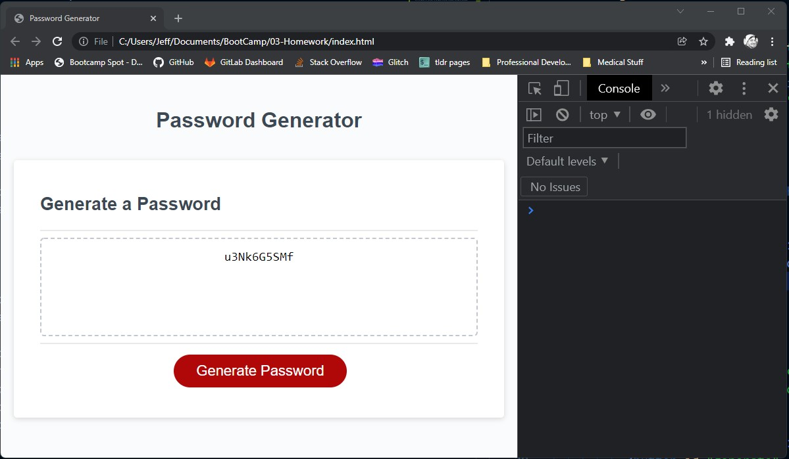

# 03-Homework
Password Generator - homework from 03-JavaScript

## Link to the Working App
https://patrickfham.github.io/03-Homework/

## The Process
I left alone these items:
  the 'writePassword' function
  the 'generateBtn' variable
  the 'generateBtn' event-listener

All the work I did in the 'generatePassword' function is my own work.
Beginning with the video that Paul Keldsen (TA) put into our #Resources channel on Slack, I did a LOT of reading and researching other password generator approaches online.  I had to refresh my memory on quite a few of these things that we covered in previous classes, like:
  the Math.floor(Math.random()) mechanic
  calling certain array positions
  assignment operators

In short:
  I formed four arrays, which are groups of character-sets.
  The user prompts (confirm) were used to catenate a single line of characters from which the randomizer will choose.
  Some fail-safes were added, so that the instructions didn't 'break.'
    Ex.1 Filtering-out user-inputs that are 'Not a Number.'
    Ex.2 Minimum and Maximum password length.
    Ex.3 Not allowing all character types to be disabled.
    Ex.4 An option for the user to not give criteria; a default setting is provided.

## Questions I still have:
I was quite literal with the criteria.  I read it, as there should be an option for the user whether-or-not to give criteria at all ... but I did not see this in Paul's demonstration video.  I figured, it was better to put it in, and not-need it, than the alternative.

Also, running this page on my local machine shows no errors at all.  It's only when it's run from GitHub Pages that there's a "favicon" 404 error.  What in the world?!

## Screenshots
  

## Video Demo
https://watch.screencastify.com/v/V9swwrYvE6oEYUKAYInR
